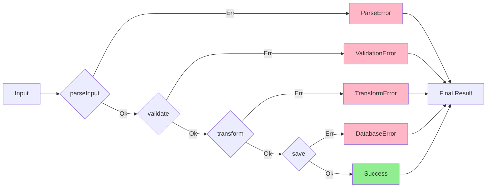

## The Problem with Exceptions

Traditional exception-based error handling has several fundamental problems that make programs harder to reason about and maintain.

### 1. Invisible Control Flow

Exceptions create hidden control flow paths:

```typescript
function processOrder(order: Order): Invoice {
  const validated = validateOrder(order)  // May throw ValidationError
  const payment = processPayment(order)    // May throw PaymentError
  const invoice = generateInvoice(order)   // May throw InvoiceError
  return invoice
}

// The function signature doesn't tell you about any of these errors!
// It's like using goto statements - you can't see where control may jump to
```

The function signature `(order: Order) => Invoice` lies about what the function actually does. It claims to always return an `Invoice`, but it might throw any number of different errors.

### 2. Unreliable Error Handling

You must trust that callers remember to catch exceptions:

```typescript
// Developer A writes this
function fetchUser(id: number): User {
  if (!isValidId(id)) {
    throw new Error('Invalid ID')
  }
  // ... database fetch that may also throw
}

// Developer B uses it (forgetting error handling)
const user = fetchUser(123)  // 💥 Uncaught exception!
console.log(user.name)
```

<Warning>
With exceptions, you're always one forgotten `try/catch` away from a production incident.
</Warning>

### 3. No Compile-Time Guarantees

TypeScript can't enforce error handling:

```typescript
function divide(a: number, b: number): number {
  if (b === 0) {
    throw new Error('Division by zero')
  }
  return a / b
}

// TypeScript is perfectly happy with this
// even though it will crash at runtime
const result = divide(10, 0)
console.log(result * 2)
```

TypeScript has no way to enforce that you handle the exception. The error only surfaces at runtime.

### 4. Documentation in Comments

You must document errors in JSDoc comments:

```typescript
/**
 * Parses user input
 * @throws {ParseError} If input is malformed
 * @throws {ValidationError} If input is invalid
 * @throws {NetworkError} If network fails
 */
function parseUserInput(input: string): User {
  // implementation
}
```

But comments:
- Can become outdated
- Are not enforced by the compiler
- Are easily ignored
- Don't integrate with IDE autocomplete

## The Solution: Encode Errors in Types

NeverThrow solves these problems by making errors part of the type system:

```typescript
function processOrder(order: Order): Result<Invoice, ProcessOrderError> {
  // Error type is visible in the signature!
}
```

Now the function signature tells the complete truth about what can happen.

## Benefits of Type-Encoded Errors

### 1. Explicit Error Handling

Errors become visible and must be handled:

```typescript
function divide(a: number, b: number): Result<number, string> {
  if (b === 0) {
    return err('Division by zero')
  }
  return ok(a / b)
}

// TypeScript forces you to handle both cases
const result = divide(10, 0)

// This won't compile if you forget to handle the error:
const value: number = result.value // ❌ Error: value doesn't exist on Result

// You must explicitly handle it:
if (result.isOk()) {
  const value: number = result.value // ✅ Type-safe
}
```

### 2. Composition and Error Tracking

TypeScript automatically tracks all possible errors:

```typescript
type ParseError = { type: 'ParseError'; message: string }
type ValidationError = { type: 'ValidationError'; field: string }
type DatabaseError = { type: 'DatabaseError'; code: number }

function parseInput(raw: string): Result<Input, ParseError> { /* ... */ }
function validate(input: Input): Result<Input, ValidationError> { /* ... */ }
function save(input: Input): Result<void, DatabaseError> { /* ... */ }

const result = parseInput(raw)
  .andThen(validate)
  .andThen(save)

// Type: Result<void, ParseError | ValidationError | DatabaseError>
// TypeScript knows ALL possible error types!
```

<Tip>
The compiler becomes your assistant, ensuring you never miss an error case.
</Tip>

### 3. Self-Documenting Code

The function signature is the documentation:

```typescript
// With exceptions - must read docs or source code
function fetchUser(id: number): User

// With Result - errors are obvious from signature
function fetchUser(id: number): Result<User, 'NotFound' | 'NetworkError' | 'Unauthorized'>
//                                      ^^^^   ^^^^^^^^^^^^^^^^^^^^^^^^^^^^^^^^^^^^^^^^
//                                      Success type    All possible errors
```

Your IDE shows you exactly what can go wrong:

```typescript
fetchUser(123). // IDE autocompletes with:
  // - map
  // - mapErr
  // - andThen
  // - match
  // etc.
```

### 4. Safe Refactoring

When you change error types, TypeScript tells you everywhere that needs updating:

```typescript
// Original
function fetchUser(id: number): Result<User, 'NotFound'> { /* ... */ }

// Add new error type
function fetchUser(id: number): Result<User, 'NotFound' | 'RateLimited'> { /* ... */ }

// TypeScript now shows errors everywhere that handles fetchUser results
// if they don't account for 'RateLimited'
```

## Comparison: Exceptions vs Results

<Tabs>
  <Tab title="With Exceptions">
    ```typescript
    // Function signatures lie about behavior
    async function createUser(data: UserData): Promise<User> {
      // Hidden error paths
      const validated = await validateUserData(data)  // may throw
      const exists = await checkUserExists(validated.email) // may throw
      if (exists) {
        throw new Error('User exists') // invisible in signature
      }
      return await db.insert('users', validated) // may throw
    }

    // Caller must remember to catch (no compiler help)
    try {
      const user = await createUser(userData)
      res.status(200).json({ user })
    } catch (error) {
      // What types of errors can occur? Who knows!
      // You must read the source code or docs
      res.status(500).json({ error: error.message })
    }
    ```
  </Tab>
  <Tab title="With Results">
    ```typescript
    // Function signature tells the complete truth
    async function createUser(
      data: UserData
    ): ResultAsync<User, ValidationError | ExistsError | DatabaseError> {
      return validateUserData(data)
        .andThen(async (validated) => {
          const exists = await checkUserExists(validated.email)
          return exists ? err(new ExistsError()) : ok(validated)
        })
        .andThen((validated) => db.insert('users', validated))
    }

    // Compiler enforces error handling
    const result = await createUser(userData)
    //    ^ Type: Result<User, ValidationError | ExistsError | DatabaseError>

    // TypeScript knows all error types
    result.match(
      (user) => res.status(200).json({ user }),
      (error) => {
        // Type narrowing works!
        if (error instanceof ValidationError) {
          res.status(400).json({ error: error.message })
        } else if (error instanceof ExistsError) {
          res.status(409).json({ error: 'User already exists' })
        } else {
          res.status(500).json({ error: 'Database error' })
        }
      }
    )
    ```
  </Tab>
</Tabs>

## Railway-Oriented Programming

The Result pattern enables "Railway-Oriented Programming" (ROP), a powerful mental model for error handling:



Think of your program as a railway:
- **Success track (Ok)**: Operations continue on the happy path
- **Error track (Err)**: Once an error occurs, we stay on the error track

```typescript
const result = parseInput(raw)    // May switch to error track
  .andThen(validate)              // Skipped if already on error track
  .andThen(transform)             // Skipped if already on error track  
  .andThen(save)                  // Skipped if already on error track
  .match(
    (success) => handleSuccess(success),
    (error) => handleError(error)
  )
```

<Note>
Once an operation returns an `Err`, all subsequent operations are automatically skipped until you explicitly handle the error with `match`, `orElse`, or `unwrapOr`.
</Note>

## Real-World Example

### E-commerce Order Processing

```typescript
type OrderError =
  | { type: 'InvalidInput'; field: string; message: string }
  | { type: 'InsufficientStock'; productId: string; available: number }
  | { type: 'PaymentFailed'; reason: string }
  | { type: 'ShippingUnavailable'; zipCode: string }

function processOrder(
  orderData: OrderData
): ResultAsync<Order, OrderError> {
  return validateOrderData(orderData)
    .andThen(checkInventory)
    .andThen(processPayment)
    .andThen(calculateShipping)
    .andThen(createOrder)
}

// Usage
const result = await processOrder(orderData)

result.match(
  (order) => {
    // Success: Send confirmation email, update UI, etc.
    return res.status(200).json({ 
      orderId: order.id,
      message: 'Order placed successfully' 
    })
  },
  (error) => {
    // TypeScript knows all possible error types
    switch (error.type) {
      case 'InvalidInput':
        return res.status(400).json({
          field: error.field,
          message: error.message
        })
      
      case 'InsufficientStock':
        return res.status(409).json({
          message: `Only ${error.available} units available`,
          productId: error.productId
        })
      
      case 'PaymentFailed':
        return res.status(402).json({
          message: `Payment failed: ${error.reason}`
        })
      
      case 'ShippingUnavailable':
        return res.status(400).json({
          message: `Shipping not available to ${error.zipCode}`
        })
    }
  }
)
```

<Tip>
Using discriminated unions for error types (like `{ type: 'ErrorName', ...fields }`) enables exhaustive type checking and excellent IDE support.
</Tip>

## When to Use Each Approach

### Use Result When:

- ✅ Errors are expected and recoverable
- ✅ You want compile-time error handling guarantees  
- ✅ You're building an API or library
- ✅ You want to compose operations that may fail
- ✅ You want self-documenting error types

### Exceptions May Be Appropriate For:

- ❓ Truly exceptional, unrecoverable errors (e.g., out of memory)
- ❓ Programming errors that should crash (e.g., assertion failures)
- ❓ Working with third-party libraries that throw extensively
- ❓ Prototyping (but transition to Result for production)

<Warning>
"Exceptional" means rare and unexpected. If you can imagine it happening during normal operation (invalid input, network failure, file not found), it's not exceptional - it's expected, and should be a Result.
</Warning>

## Migrating from Exceptions

### Strategy 1: Wrap at Boundaries

Wrap exception-throwing code at your system boundaries:

```typescript
import { Result } from 'neverthrow'

// Third-party library that throws
import { dangerousLibrary } from 'some-library'

// Wrap it immediately
function safeLibraryCall(input: string): Result<Output, Error> {
  return Result.fromThrowable(
    () => dangerousLibrary.parse(input),
    (error) => error instanceof Error ? error : new Error(String(error))
  )()
}

// Now use Result throughout your code
```

**Source:** [result.ts:23-35](~/workspace/source/src/result.ts:23)

### Strategy 2: Incremental Adoption

Start with new features, gradually migrate old code:

```typescript
// New feature: uses Result
function createUserV2(data: UserData): ResultAsync<User, CreateUserError> {
  return validateUserData(data)
    .andThen(saveToDatabase)
    .andThen(sendWelcomeEmail)
}

// Old feature: still uses exceptions
function createUserV1(data: UserData): Promise<User> {
  // ... throws exceptions
}

// Adapter to use old code with new code
function createUserV1Wrapped(data: UserData): ResultAsync<User, Error> {
  return ResultAsync.fromPromise(
    createUserV1(data),
    (error) => error instanceof Error ? error : new Error(String(error))
  )
}
```

### Strategy 3: Use fromThrowable for Quick Wins

Quickly make existing code safer:

```typescript
// Before: dangerous
const parsed = JSON.parse(userInput)

// After: safe
const safeParse = Result.fromThrowable(
  JSON.parse,
  () => 'Invalid JSON'
)

const result = safeParse(userInput)
result.match(
  (parsed) => console.log('Success:', parsed),
  (error) => console.error('Error:', error)
)
```

## Learning Resources from Source Code

The NeverThrow source code demonstrates the philosophy:

### IResult Interface (result.ts:134-310)

Defines the contract that both `Ok` and `Err` implement, ensuring consistent behavior:

```typescript
interface IResult<T, E> {
  isOk(): this is Ok<T, E>
  isErr(): this is Err<T, E>
  map<A>(f: (t: T) => A): Result<A, E>
  mapErr<U>(f: (e: E) => U): Result<T, U>
  andThen<U, F>(f: (t: T) => Result<U, F>): Result<U, E | F>
  // ...
}
```

### Ok Implementation (result.ts:312-417)

Shows how the "success track" short-circuits error operations:

```typescript
export class Ok<T, E> implements IResult<T, E> {
  // mapErr does nothing for Ok - stays on success track
  mapErr<U>(_f: (e: E) => U): Result<T, U> {
    return ok(this.value)
  }
  
  // orElse does nothing for Ok - already successful
  orElse<U, A>(_f: (e: E) => Result<U, A>): Result<U | T, A> {
    return ok(this.value)
  }
}
```

### Err Implementation (result.ts:419-521)

Shows how the "error track" short-circuits success operations:

```typescript
export class Err<T, E> implements IResult<T, E> {
  // map does nothing for Err - stays on error track
  map<A>(_f: (t: T) => A): Result<A, E> {
    return err(this.error)
  }
  
  // andThen does nothing for Err - already failed
  andThen<U, F>(_f: (t: T) => Result<U, F>): Result<U, E | F> {
    return err(this.error)
  }
}
```

## Conclusion

By encoding errors in types, NeverThrow transforms error handling from:
- ❌ Runtime problem → ✅ Compile-time problem
- ❌ Hidden control flow → ✅ Explicit control flow
- ❌ Documentation in comments → ✅ Documentation in types
- ❌ Trust-based → ✅ Compiler-enforced
- ❌ Easy to forget → ✅ Impossible to ignore

As the README states:

> Although the package is called `neverthrow`, please don't take this literally. I am simply encouraging the developer to think a bit more about the ergonomics and usage of whatever software they are writing.
>
> `Throw`ing and `catching` is very similar to using `goto` statements - in other words; it makes reasoning about your programs harder.

**Source:** [README.md:1675-1679](~/workspace/source/README.md:1675)

<Note>
The goal isn't to eliminate all exceptions, but to use them appropriately. Results should be your default for expected, recoverable errors.
</Note>

## Next Steps

<CardGroup cols={2}>
  <Card title="Result Type" icon="box" href="./result-type">
    Learn the fundamentals of the Result type
  </Card>
  <Card title="ResultAsync Type" icon="clock" href="./result-async">
    Handle asynchronous operations with ResultAsync
  </Card>
</CardGroup>