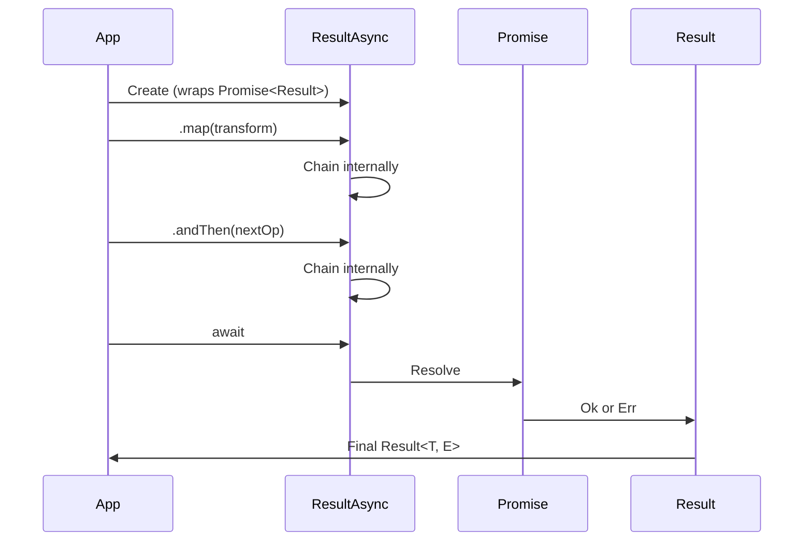

## Overview

`ResultAsync<T, E>` is a class that wraps a `Promise<Result<T, E>>`, providing a seamless way to work with asynchronous operations that may fail.

```typescript
export class ResultAsync<T, E> implements PromiseLike<Result<T, E>> {
  private _promise: Promise<Result<T, E>>

  constructor(res: Promise<Result<T, E>>) {
    this._promise = res
  }
  // ...
}
```

**Source:** [result-async.ts:22-27](~/workspace/source/src/result-async.ts:22)

The key insight: `ResultAsync` is essentially a `Promise<Result<T, E>>` with additional methods that let you work with the `Result` without having to `await` it first.

## Why ResultAsync?

### The Problem with Async Results

When working with promises and results together, you'd normally have to write:

```typescript
// Awkward: need to await before using Result methods
const promise: Promise<Result<User, Error>> = fetchUser(id)
const result = await promise
const transformed = result.map(user => user.name)
```

### The Solution

`ResultAsync` lets you chain operations without awaiting:

```typescript
// Clean: chain operations directly
const resultAsync: ResultAsync<User, Error> = fetchUser(id)
const transformed = resultAsync.map(user => user.name)
// transformed is ResultAsync<string, Error>

// await only when you need the final value
const final = await transformed
```

## Creating ResultAsync

### Method 1: okAsync and errAsync

Create a ResultAsync from a value:

```typescript
import { okAsync, errAsync } from 'neverthrow'

const success = okAsync(42)
// Type: ResultAsync<number, never>

const failure = errAsync('Something went wrong')
// Type: ResultAsync<never, string>
```

**Source:** [result-async.ts:247-256](~/workspace/source/src/result-async.ts:247)

### Method 2: fromPromise

Wrap an existing promise that may reject:

```typescript
import { ResultAsync } from 'neverthrow'

// Original promise that may throw
const promise: Promise<User> = fetch('/api/user').then(r => r.json())

// Convert to ResultAsync
const resultAsync = ResultAsync.fromPromise(
  promise,
  (error) => `Failed to fetch user: ${error}`
)
// Type: ResultAsync<User, string>
```

**Source:** [result-async.ts:36-42](~/workspace/source/src/result-async.ts:36)

<Note>
The second argument to `fromPromise` is an error handler that converts the unknown error into your error type `E`.
</Note>

### Method 3: fromSafePromise

Wrap a promise that you know will never reject:

```typescript
import { ResultAsync } from 'neverthrow'

const delay = (ms: number) => 
  new Promise<void>(resolve => setTimeout(resolve, ms))

const resultAsync = ResultAsync.fromSafePromise(delay(1000))
// Type: ResultAsync<void, never>
```

**Source:** [result-async.ts:29-34](~/workspace/source/src/result-async.ts:29)

<Warning>
Only use `fromSafePromise` when you're absolutely certain the promise won't reject. If it does reject, the `ResultAsync` will reject the promise instead of resolving to an `Err`.
</Warning>

### Method 4: fromThrowable

Wrap a function that returns a promise and may throw:

```typescript
import { ResultAsync } from 'neverthrow'
import { db } from './database'

// Original async function that may throw
const insertUser = async (user: User): Promise<User> => {
  return await db.insert('users', user)
}

// Wrap it to return ResultAsync
const safeInsertUser = ResultAsync.fromThrowable(
  insertUser,
  (error) => new DatabaseError(error)
)

// Now it's safe to use
const result = safeInsertUser({ name: 'Alice', email: 'alice@example.com' })
// Type: ResultAsync<User, DatabaseError>
```

**Source:** [result-async.ts:45-61](~/workspace/source/src/result-async.ts:45)

<Tip>
`fromThrowable` is safer than `fromPromise` because it catches both synchronous throws (before the promise is returned) and asynchronous rejections.
</Tip>

## The Thenable Behavior

`ResultAsync` implements `PromiseLike<Result<T, E>>`, which means it's "thenable" and can be used with `await` and `.then()`:

```typescript
// Makes ResultAsync implement PromiseLike<Result>
then<A, B>(
  successCallback?: (res: Result<T, E>) => A | PromiseLike<A>,
  failureCallback?: (reason: unknown) => B | PromiseLike<B>,
): PromiseLike<A | B> {
  return this._promise.then(successCallback, failureCallback)
}
```

**Source:** [result-async.ts:226-232](~/workspace/source/src/result-async.ts:226)

### Using with async/await

```typescript
async function getUserData(id: number) {
  // ResultAsync can be awaited like a regular Promise
  const result = await fetchUser(id)
  //    ^ Type: Result<User, Error>
  
  if (result.isOk()) {
    return result.value
  } else {
    throw result.error
  }
}
```

### Using with .then()

```typescript
fetchUser(id)
  .then((result: Result<User, Error>) => {
    result.match(
      (user) => console.log('Success:', user),
      (error) => console.error('Error:', error)
    )
  })
```

### Mixing with Promise.all

```typescript
const [user, posts, comments] = await Promise.all([
  fetchUser(id),
  fetchPosts(id),
  fetchComments(id),
])
// All three are Result<T, E> types
```

## Methods: Sync vs Async Parameters

Many `ResultAsync` methods accept both synchronous and asynchronous functions:

### map - Synchronous or Asynchronous

```typescript
map<A>(f: (t: T) => A | Promise<A>): ResultAsync<A, E>
```

**Source:** [result-async.ts:89-99](~/workspace/source/src/result-async.ts:89)

```typescript
// Synchronous transformation
const result1 = fetchUser(id)
  .map(user => user.name)
  // Returns immediately with ResultAsync<string, Error>

// Asynchronous transformation
const result2 = fetchUser(id)
  .map(async (user) => {
    const avatar = await fetchAvatar(user.avatarId)
    return { ...user, avatar }
  })
  // Returns ResultAsync<UserWithAvatar, Error>
```

### mapErr - Transform Errors

```typescript
mapErr<U>(f: (e: E) => U | Promise<U>): ResultAsync<T, U>
```

**Source:** [result-async.ts:149-159](~/workspace/source/src/result-async.ts:149)

```typescript
const result = fetchUser(id)
  .mapErr(error => `User fetch failed: ${error.message}`)
  // ResultAsync<User, string>
```

### andThen - Chain Dependent Operations

```typescript
andThen<U, F>(
  f: (t: T) => Result<U, F> | ResultAsync<U, F>
): ResultAsync<U, E | F>
```

**Source:** [result-async.ts:161-180](~/workspace/source/src/result-async.ts:161)

```typescript
const result = fetchUser(id)
  .andThen(user => validateUser(user))     // Returns Result<User, ValidationError>
  .andThen(user => saveUser(user))         // Returns ResultAsync<void, SaveError>
  // Final type: ResultAsync<void, FetchError | ValidationError | SaveError>
```

<Note>
`andThen` accepts both `Result` and `ResultAsync` return types, automatically handling the conversion.
</Note>

## Chaining Operations

One of the most powerful features of `ResultAsync` is the ability to chain multiple asynchronous operations:

```typescript
const result = fetchUser(id)
  .map(user => user.email)                    // Extract email
  .andThen(email => validateEmail(email))     // Validate (may fail)
  .andThen(email => sendWelcomeEmail(email))  // Send email (may fail)
  .map(() => 'Email sent successfully')       // Transform success
  .mapErr(error => `Failed: ${error}`)        // Transform error

// Type: ResultAsync<string, string>

// Handle the final result
await result.match(
  (message) => console.log(message),
  (error) => console.error(error)
)
```

## Side Effects with andTee and orTee

### andTee - Side Effects on Success

Execute a side effect on success without changing the value:

```typescript
andTee(f: (t: T) => unknown): ResultAsync<T, E>
```

**Source:** [result-async.ts:117-131](~/workspace/source/src/result-async.ts:117)

```typescript
const result = fetchUser(id)
  .andTee(user => console.log('Fetched user:', user.name)) // Log but don't change
  .andThen(user => saveUser(user))                         // Still has full user object
```

### orTee - Side Effects on Error

Execute a side effect on error without changing the error:

```typescript
orTee(f: (t: E) => unknown): ResultAsync<T, E>
```

**Source:** [result-async.ts:133-147](~/workspace/source/src/result-async.ts:133)

```typescript
const result = fetchUser(id)
  .orTee(error => logError('User fetch failed', error)) // Log error
  .orElse(() => fetchUserFromCache(id))                 // Try recovery
```

<Tip>
Use `andTee` and `orTee` for logging, metrics, or other side effects that shouldn't affect your main logic flow.
</Tip>

## Advanced Patterns

### Pattern 1: Parallel Operations with combine

```typescript
import { ResultAsync } from 'neverthrow'

const combined = ResultAsync.combine([
  fetchUser(1),
  fetchUser(2),
  fetchUser(3),
])
// Type: ResultAsync<[User, User, User], Error>

combined.match(
  ([user1, user2, user3]) => console.log('All users fetched'),
  (error) => console.error('At least one fetch failed:', error)
)
```

**Source:** [result-async.ts:63-73](~/workspace/source/src/result-async.ts:63)

### Pattern 2: Collecting All Errors

```typescript
const combined = ResultAsync.combineWithAllErrors([
  fetchUser(1),
  fetchUser(2),
  fetchUser(3),
])
// Type: ResultAsync<[User, User, User], Error[]>

// If users 1 and 3 fail, you get all errors
await combined.match(
  (users) => console.log('All succeeded'),
  (errors) => console.error('Errors:', errors) // Array of all errors
)
```

**Source:** [result-async.ts:75-87](~/workspace/source/src/result-async.ts:75)

### Pattern 3: Sequential with Error Recovery

```typescript
const result = fetchFromPrimaryDB(id)
  .orElse(() => fetchFromSecondaryDB(id))     // Fallback 1
  .orElse(() => fetchFromCache(id))           // Fallback 2  
  .orElse(() => okAsync(defaultUser))         // Final fallback
```

### Pattern 4: Transform and Unwrap

```typescript
const userName = await fetchUser(id)
  .map(user => user.name)
  .unwrapOr('Anonymous')
// Type: string (not Result!)
```

## Comparison: Promise of Result vs ResultAsync

<Tabs>
  <Tab title="Promise of Result">
    ```typescript
    async function processUser(id: number) {
      const userResult = await fetchUser(id)
      if (userResult.isErr()) {
        return err(userResult.error)
      }
      
      const validResult = await validateUser(userResult.value)
      if (validResult.isErr()) {
        return err(validResult.error)
      }
      
      const saveResult = await saveUser(validResult.value)
      return saveResult
    }
    ```
  </Tab>
  <Tab title="ResultAsync">
    ```typescript
    function processUser(id: number) {
      return fetchUser(id)
        .andThen(validateUser)
        .andThen(saveUser)
    }
    ```
  </Tab>
</Tabs>

## Visual Flow



## Performance Considerations

### Chaining is Efficient

```typescript
// This creates only ONE promise
const result = fetchUser(id)
  .map(u => u.email)
  .map(e => e.toLowerCase())
  .map(e => e.trim())

// Internally, all transformations are applied in a single .then()
```

### Avoid Unnecessary Awaits

```typescript
// ❌ Bad: Unnecessary await in the middle
async function process(id: number) {
  const user = await fetchUser(id)  // Breaks the chain
  return user.map(u => u.name)
}

// ✅ Good: Keep the chain intact
function process(id: number) {
  return fetchUser(id)
    .map(u => u.name)
}
```

## Type Signatures from Source

```typescript
// Constructor
class ResultAsync<T, E> implements PromiseLike<Result<T, E>> {
  constructor(res: Promise<Result<T, E>>)
}

// Static constructors
function okAsync<T, E = never>(value: T): ResultAsync<T, E>
function errAsync<T = never, E = unknown>(err: E): ResultAsync<T, E>

// Static methods
static fromPromise<T, E>(
  promise: Promise<T>,
  errorFn: (e: unknown) => E
): ResultAsync<T, E>

static fromSafePromise<T, E = never>(
  promise: Promise<T>
): ResultAsync<T, E>

static fromThrowable<A extends readonly any[], R, E>(
  fn: (...args: A) => Promise<R>,
  errorFn?: (err: unknown) => E
): (...args: A) => ResultAsync<R, E>

// Instance methods
map<A>(f: (t: T) => A | Promise<A>): ResultAsync<A, E>
mapErr<U>(f: (e: E) => U | Promise<U>): ResultAsync<T, U>
andThen<U, F>(f: (t: T) => Result<U, F> | ResultAsync<U, F>): ResultAsync<U, E | F>
orElse<U, A>(f: (e: E) => Result<U, A> | ResultAsync<U, A>): ResultAsync<U | T, A>
match<A, B = A>(ok: (t: T) => A, err: (e: E) => B): Promise<A | B>
unwrapOr<A>(t: A): Promise<T | A>
```

## Next Steps

<CardGroup cols={2}>
  <Card title="Result Type" icon="box" href="./result-type">
    Learn about the synchronous Result type
  </Card>
  <Card title="Error Handling Philosophy" icon="shield-check" href="./error-handling">
    Understand why encoding errors in types is better than throwing
  </Card>
</CardGroup>