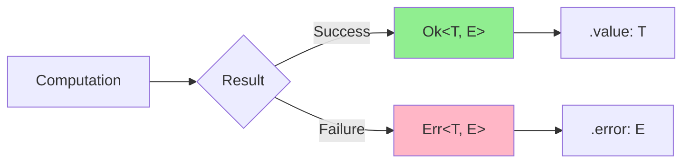

## Overview

The `Result<T, E>` type is the foundation of NeverThrow. It represents a computation that can either succeed with a value of type `T` (wrapped in `Ok`) or fail with an error of type `E` (wrapped in `Err`).

```typescript
type Result<T, E> = Ok<T, E> | Err<T, E>
```

**Source:** [result.ts:62](~/workspace/source/src/result.ts:62)

This type is inspired by Rust's `Result` type and provides a type-safe way to handle errors without throwing exceptions.

## The Two Variants

### Ok Variant

The `Ok` variant represents a successful computation. It wraps a value of type `T`.

```typescript
export class Ok<T, E> implements IResult<T, E> {
  constructor(readonly value: T) {}
  
  isOk(): this is Ok<T, E> {
    return true
  }
  
  isErr(): this is Err<T, E> {
    return false
  }
  // ... more methods
}
```

**Source:** [result.ts:312-417](~/workspace/source/src/result.ts:312)

**Creating an Ok value:**

```typescript
import { ok } from 'neverthrow'

const result = ok(42)
// Type: Result<number, never>

const user = ok({ id: 1, name: 'Alice' })
// Type: Result<{ id: number; name: string }, never>
```

### Err Variant

The `Err` variant represents a failed computation. It wraps an error value of type `E`.

```typescript
export class Err<T, E> implements IResult<T, E> {
  constructor(readonly error: E) {}
  
  isOk(): this is Ok<T, E> {
    return false
  }
  
  isErr(): this is Err<T, E> {
    return true
  }
  // ... more methods
}
```

**Source:** [result.ts:419-521](~/workspace/source/src/result.ts:419)

**Creating an Err value:**

```typescript
import { err } from 'neverthrow'

const result = err('Something went wrong')
// Type: Result<never, string>

const validationError = err({ field: 'email', message: 'Invalid format' })
// Type: Result<never, { field: string; message: string }>
```

## Type Safety Benefits

### 1. Explicit Error Handling

With `Result`, errors are part of the type signature. This forces you to handle errors explicitly:

```typescript
function divide(a: number, b: number): Result<number, string> {
  if (b === 0) {
    return err('Division by zero')
  }
  return ok(a / b)
}

// TypeScript knows this returns Result<number, string>
const result = divide(10, 2)

// You must handle both cases
if (result.isOk()) {
  console.log('Result:', result.value)
} else {
  console.error('Error:', result.error)
}
```

### 2. Type Narrowing

The `isOk()` and `isErr()` methods act as type guards, narrowing the type within conditional blocks:

```typescript
const result: Result<number, string> = divide(10, 0)

if (result.isOk()) {
  // TypeScript knows result is Ok<number, string>
  const value: number = result.value // ✓ Type-safe access
  // result.error // ✗ TypeScript error: Property 'error' does not exist
}

if (result.isErr()) {
  // TypeScript knows result is Err<number, string>
  const error: string = result.error // ✓ Type-safe access
  // result.value // ✗ TypeScript error: Property 'value' does not exist
}
```

### 3. Composable Error Types

Results can be chained, and TypeScript tracks the union of all possible error types:

```typescript
function parseUser(data: string): Result<User, ParseError> { /* ... */ }
function validateUser(user: User): Result<User, ValidationError> { /* ... */ }
function saveUser(user: User): Result<void, DatabaseError> { /* ... */ }

const result = parseUser(data)
  .andThen(validateUser)
  .andThen(saveUser)

// Type: Result<void, ParseError | ValidationError | DatabaseError>
```

<Note>
TypeScript automatically infers and combines error types when chaining operations, ensuring you never miss a possible error case.
</Note>

### 4. No Silent Failures

Unlike exceptions that can be thrown and forgotten, `Result` forces you to acknowledge the possibility of failure:

```typescript
// With exceptions - easy to forget error handling
function riskyOperation(): number {
  throw new Error('Oops') // Caller may not know this throws
}

// With Result - error is in the signature
function safeOperation(): Result<number, Error> {
  return err(new Error('Oops')) // Caller MUST handle the error
}
```

## Comparison: Exceptions vs Result

<Tabs>
  <Tab title="With Exceptions">
    ```typescript
    function getUserById(id: number): User {
      const user = database.findUser(id) // May throw
      if (!user) {
        throw new Error('User not found') // Hidden in implementation
      }
      return user
    }

    // Caller has no idea this might throw
    try {
      const user = getUserById(123)
      console.log(user.name)
    } catch (error) {
      // We might forget this!
      console.error(error)
    }
    ```
  </Tab>
  <Tab title="With Result">
    ```typescript
    function getUserById(id: number): Result<User, string> {
      const user = database.findUser(id)
      if (!user) {
        return err('User not found') // Explicit in return type
      }
      return ok(user)
    }

    // Caller knows this returns a Result
    const result = getUserById(123)
    
    // TypeScript forces us to handle both cases
    result.match(
      (user) => console.log(user.name),
      (error) => console.error(error)
    )
    ```
  </Tab>
</Tabs>

## Visual Representation



## Pattern: Railway-Oriented Programming

The `Result` type enables "railway-oriented programming" where your program flows on two tracks:

```typescript
// Happy path (Ok track) ──────────────────────────>
//                     ↓ error
// Error path (Err track) ─────────────────────────>

const result = parseInput(raw)      // May fail at parsing
  .map(transform)                   // May fail at transform
  .andThen(validate)                // May fail at validation
  .andThen(save)                    // May fail at saving

// All errors are collected in the type:
// Result<SavedData, ParseError | TransformError | ValidationError | SaveError>
```

<Tip>
Think of `Result` as a railway switch: operations on the "Ok track" continue the happy path, while operations on the "Err track" bypass remaining operations and carry the error forward.
</Tip>

## Common Patterns

### Pattern 1: Transform Success Values

Use `map` to transform the success value:

```typescript
const result = ok(5)
  .map(x => x * 2)      // Ok(10)
  .map(x => x + 1)      // Ok(11)
  .map(x => `Result: ${x}`) // Ok("Result: 11")
```

### Pattern 2: Chain Fallible Operations

Use `andThen` when the next operation might also fail:

```typescript
const result = parseJSON(input)
  .andThen(validateSchema)  // Returns Result
  .andThen(processData)     // Returns Result
```

### Pattern 3: Error Recovery

Use `orElse` to recover from errors:

```typescript
const result = fetchFromCache(key)
  .orElse(() => fetchFromDatabase(key))
  .orElse(() => ok(defaultValue))
```

### Pattern 4: Extract Values Safely

Use `unwrapOr` to provide a default value:

```typescript
const count = getItemCount()
  .unwrapOr(0) // Returns 0 if Err
```

<Warning>
Avoid using `_unsafeUnwrap()` outside of tests. It throws an exception if the Result is an Err, defeating the purpose of type-safe error handling.
</Warning>

## Type Signatures from Source

Here are the key type signatures from the implementation:

```typescript
// Constructor functions
function ok<T, E = never>(value: T): Ok<T, E>
function err<T = never, E = unknown>(err: E): Err<T, E>

// Type guards
interface IResult<T, E> {
  isOk(): this is Ok<T, E>
  isErr(): this is Err<T, E>
}

// Transformation methods
interface IResult<T, E> {
  map<A>(f: (t: T) => A): Result<A, E>
  mapErr<U>(f: (e: E) => U): Result<T, U>
  andThen<U, F>(f: (t: T) => Result<U, F>): Result<U, E | F>
  orElse<U, A>(f: (e: E) => Result<U, A>): Result<U | T, A>
}
```

**Source:** [result.ts:134-310](~/workspace/source/src/result.ts:134)

## Next Steps

<CardGroup cols={2}>
  <Card title="ResultAsync Type" icon="clock" href="./result-async">
    Learn about handling asynchronous operations with ResultAsync
  </Card>
  <Card title="Error Handling Philosophy" icon="shield-check" href="./error-handling">
    Understand the philosophy behind encoding errors in types
  </Card>
</CardGroup>